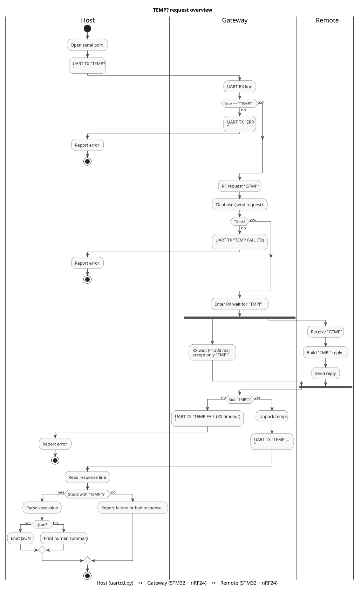
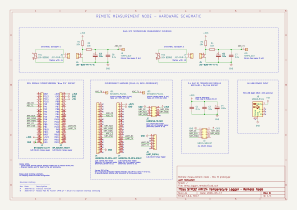

# STM32 + nRF24 Temperature Logger

This repository contains an end-to-end embedded system for measuring radiator temperatures using STM32 microcontrollers and nRF24L01+ radios, with Python-based host tooling for logging and analysis.

🚧 Documentation and code will be added incrementally.

---

## System Overview

The system consists of three cooperating components:

- **Host** – Python CLI tool (`uartctl.py`) used to query measurements and log data.
- **Gateway** – STM32 + nRF24 node that bridges the UART interface to the RF network.
- **Remote Node** – STM32 + nRF24 sensor node that measures temperatures and replies to requests.

The most common transaction is the `TEMP?` command, where the host requests temperature data from the remote node through the gateway.

The following diagram illustrates the high-level request flow.

*Overview of the TEMP? transaction path between host, gateway and remote node.*

A more detailed implementation-level flow diagram is available in
[docs/diagrams/get_temperature_activity_detailed.svg](docs/diagrams/get_temperature_activity_detailed.svg).

## Repositories

The system is implemented as a set of focused repositories:

- **uartctl** – host-side Python CLI tool for interacting with the system  
  [https://github.com/honkajan/uartctl](https://github.com/honkajan/uartctl)

- **gateway-fw** – STM32 firmware for the UART-to-nRF24 gateway node  
  [https://github.com/honkajan/gateway-fw](https://github.com/honkajan/gateway-fw)

- **remote-fw** – STM32 firmware for the remote temperature measurement node  
  [https://github.com/honkajan/remote-fw](https://github.com/honkajan/remote-fw)

## Remote Measurement Node – Hardware Overview

The remote node consists of:

- STM32F103C8T6 "Blue Pill" microcontroller module
- nRF24L01+ PA/LNA 2.4 GHz RF module
- Dual NTC temperature measurement front-end
- USB-powered carrier board
- Plug-in interconnect harness (semi-permanent)

## Remote Node – Hardware Schematic (RevB)

*Remote node schematic (RevB) with optimized ADC front-end filtering.*

**RevB updates:**
- Reduced ADC front-end RC filter (470 µF → 10 µF)
- Improved startup settling time (~20 s → ~3 s)

[Download schematic (PDF)](docs/hardware/exports/remote_node_schematic_revB.pdf)

> See [docs/hardware/README.md](docs/hardware/README.md) for full revision history.

