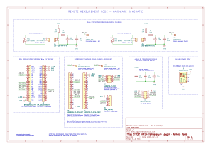

# STM32 + nRF24 Temperature Logger

This repository contains an end-to-end embedded system for measuring radiator temperatures using STM32 microcontrollers and nRF24L01+ radios, with Python-based host tooling for logging and analysis.

🚧 Documentation and code will be added incrementally.

---

## Remote Measurement Node – Hardware Overview

The remote node consists of:

- STM32F103C8T6 "Blue Pill" microcontroller module
- nRF24L01+ PA/LNA 2.4 GHz RF module
- Dual NTC temperature measurement front-end
- USB-powered carrier board
- Plug-in interconnect harness (semi-permanent)

## Remote Node – Hardware Schematic (Rev A)

PDF version available here:
[Download schematic (PDF)](docs/remote_node_schematic_revA.pdf)

